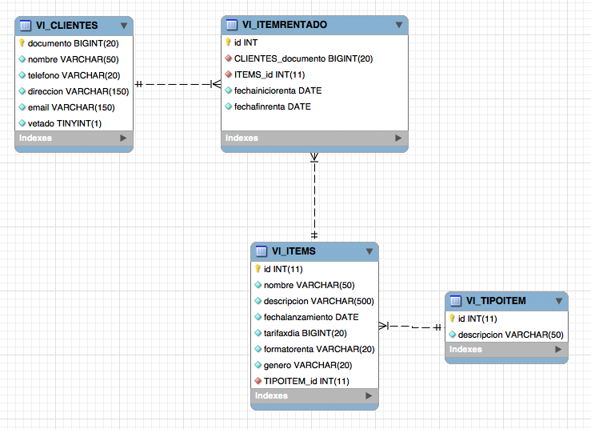

### Escuela Colombiana de Ingeniería
### Procesos de Desarrollo de Software - PDSW
## Laboratorio - Patrón DAO, JDBC, y pruebas.

###Parte 1. JDBC (Para hacer en clase).

En un motor de base de datos MySQL Se tiene un esquema con el siguiente modelo de base de datos (un registro de pedidos de productos):


1. Clone el proyecto disponible en https://github.com/PDSW-ECI/JDBC_Intro.git .
3. Ajuste los parámetros de conexión del programa:

	```java
String url="jdbc:mysql://desarrollo.is.escuelaing.edu.co:3306/bdprueba";
String driver="com.mysql.jdbc.Driver";
String user="bdprueba";
String pwd="bdprueba";
```


2. Revise la documentación de ‘PreparedStatement’, del API JDBC:
[http://docs.oracle.com/javase/tutorial/jdbc/basics/prepared.html](http://docs.oracle.com/javase/tutorial/jdbc/basics/prepared.html). Teniendo en cuenta esto, implemente las operaciones faltantes (la operación que hace el cálculo del valor de un pedido debe hacerlo mediante SQL). Para las operaciones c y d use su código de estudiante, de manera que no haya conflicto con sus compañeros (todos están usando la misma base de datos).

	* nombresProductosPedido
	* valorTotalPedido
	* cambiarNombreProducto
	* registrarNuevoProducto

5. Ejecute las operaciones y rectifique los resultados. Operaciones a y b por pantalla, operaciones c y d consultando en la base de datos con un cliente MySQL.

### Parte 2. Patrón DAO (Para el Jueves).

####Nota: este ejercicio se debe realizar colaborativamente haciendo uso de un repositorio git centralizado tal como github o gitlab.

Para este ejercicio, va a implementar uno de los componentes de la capa de persistencia para la capa lógica del ejercicio anterior (Video renta). El siguiente, es el modelo de base de datos en el que se va a hacer persistente la información registrada a través de la aplicación:




1. A partir de lo revisado en el punto 1, implemente SÓLO las operaciones:
	* load() de JDBCDAOTipoItem
	* save() y load() de JDBCDAOItem
	* load() de JDBCDAOClientes

2. Compruebe la funcionalidad con el programa sumunistrado (TextView).

